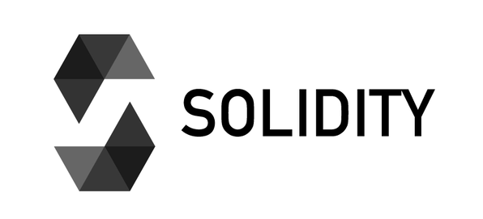

# Welcome to the world of Solidity! 👋

>This repository is designed to provide you with a quick introduction to the Solidity language, as well as links to useful tutorials to get you started. Solidity is a smart contract-oriented programming language, used primarily to develop decentralized applications (`dApps`) on the Ethereum blockchain.

## What is Solidity? 🤔

>`Solidity` is a high-level programming language specially designed for writing smart contracts on the Ethereum blockchain. It is heavily influenced by the syntax of popular languages such as JavaScript and C++, making the transition easier for developers familiar with these languages. [Smart contracts](https://github.com/ChainShareLabs/SmartContracts/blob/main/README.md) written in Solidity are executed on the Ethereum Virtual Machine (EVM) and can interact with other contracts and digital assets on the blockchain.

## Solidity Tutorials 👨‍🏫👩‍🏫

Here's a list of Solidity tutorials to help you learn the skills you need to develop smart contracts:

1. [Solidity tutorial from the official documentation](https://docs.soliditylang.org/en/latest/solidity-by-example.html) - This official tutorial provides a comprehensive introduction to Solidity and covers various key concepts of the language with practical examples.

2. [CryptoZombies](https://cryptozombies.io/) - CryptoZombies is an interactive, educational game that takes you step-by-step through the process of developing smart contracts in Solidity. It covers the basics of the language and lets you create your own blockchain-based game.

3. [Solidity Tutorial on Dapp University](https://www.dappuniversity.com) - This video tutorial guides you through the basics of Solidity and shows you how to build decentralized applications (dApps) on Ethereum using this language.

4. [Ethereum Pet Shop](https://www.trufflesuite.com/tutorials/pet-shop) - This hands-on tutorial shows you how to build a simple dApp step-by-step, using Solidity and the Truffle development framework.

5. [Solidity by Example](https://solidity-by-example.org/) - This site offers a collection of Solidity smart contracts with code examples and detailed explanations to help you understand and learn the language.

6. [ChainShot Solidity Learning Path](https://www.chainshot.com/learn/solidity) - ChainShot offers an interactive learning path for Solidity, with hands-on exercises and challenges to strengthen your smart contract development skills.

7. [Alchemy University](https://university.alchemy.com/home) - Alchemy University offers a series of courses on blockchain and smart contract development, including Solidity-specific resources, to help you gain in-depth knowledge.

8. [freeCodeCamp](https://youtu.be/gyMwXuJrbJQ) - Learn Blockchain, Solidity, and Full Stack Web3 Development with JavaScript – 32-Hour Course.

9. [freeCodeCamp](https://youtu.be/M576WGiDBdQ) - Solidity, Blockchain, and Smart Contract Course – Beginner to Expert Python Tutorial

 

>Feel free to explore these resources and deepen your knowledge of Solidity. `Happy programming smart contracts! 💻🚀`
